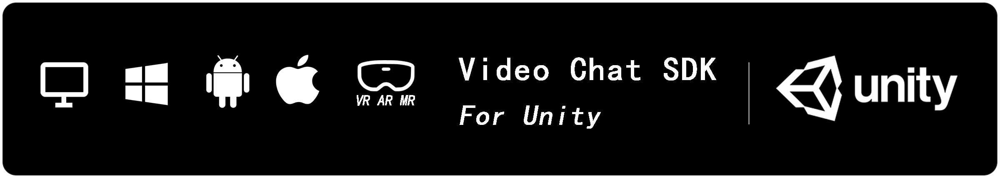
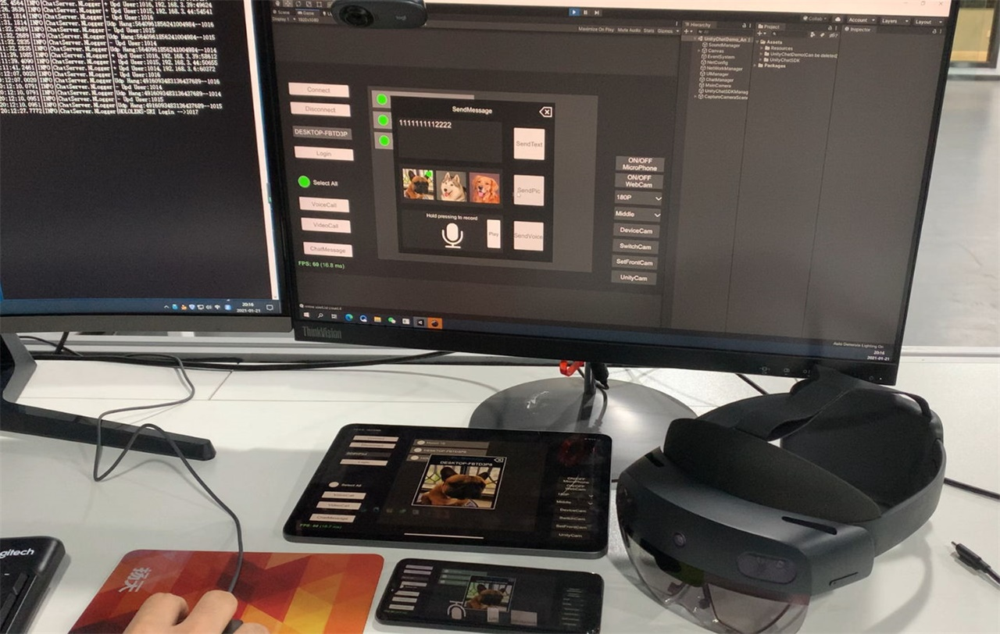
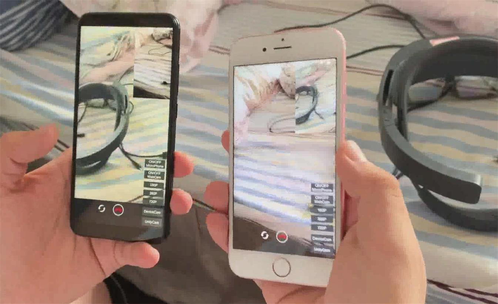
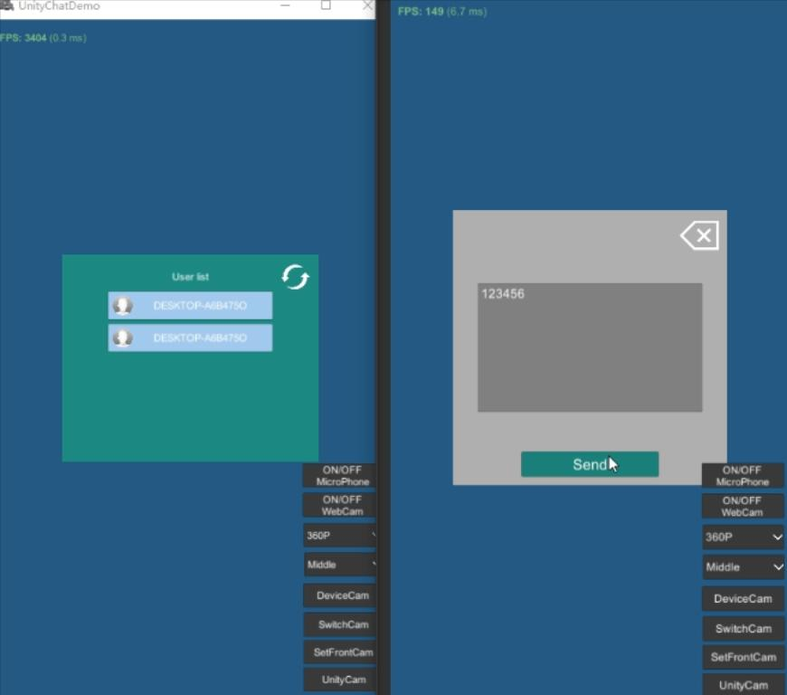
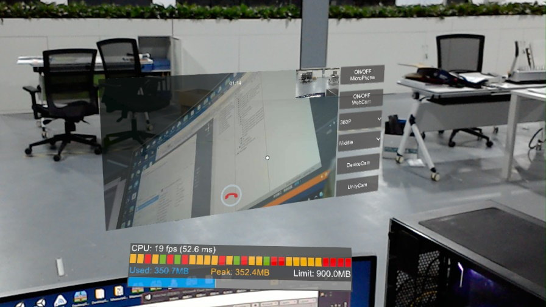
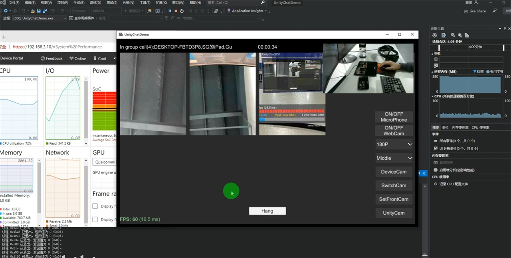
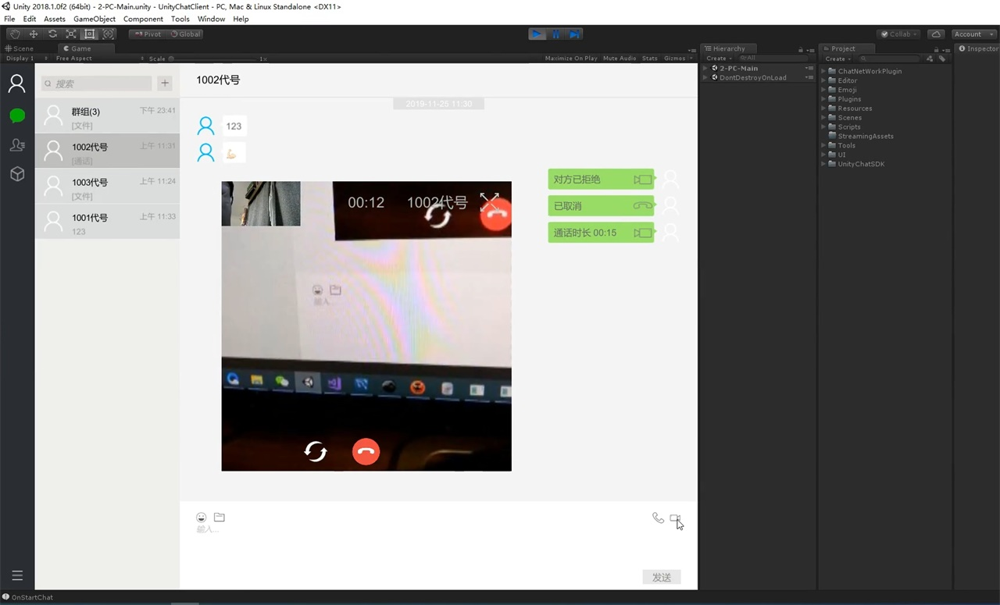

# Unity Video Chat SDK

*English* ｜ [**中文**](README.zh.md)

## Description

> Unity Video Chat SDK  supports UnityEditor,Android,iOS,Windows,UWP(Hololens1&2),MR/AR/VR Glasses...
> Multiple video types:device camera/unity camera/custom texture.
> The interface is simple, the video/audio capture and codec are separated, you can insert the sdk to your own network easily.

[Document](https://github.com/ShanguUncle/UnityChatSDK/blob/master/Readme/VideoChatSDK.pdf)

## Features

- [x] Support Unity editor, Android, iOS, Windows/Mac/Linux, UWP.
- [x] Support multiple video types:device camera/unity camera/custom texture/pc screen.
- [x] Support VR,AR,MR video(htc/oculus/arfoundation/vuforia/hololens).
- [x] Support 180P (320x180), 360P (640x360), 720P (1280x720), 1080P (1920x1080) video resolution.
- [x] Support dynamically set video resolution and compression quality
- [x] Support one-to-one, one-to-many audio and video chat.
- [x] Support server record chat video.

## Known Issues
> Echo has problems on mobile platforms,the current solution is to switch to earpiece playback during calls!
## Latest Version Update
- SDK update to **v8.2**

[View all version updates](VersionUpdates.md)

## Video Tutorials

| Tutorials                                             | Location                                             |
| ----------------------------------------------------- | ---------------------------------------------------- |
| UnityChatSDK v8.2                                     | [View](https://www.bilibili.com/video/BV1DY411j7UG/) |
| UnityChatSDK v7.1                                     | [View](https://www.bilibili.com/video/BV1ZK4y1H7dM/) |
|                                                       | [View](https://www.bilibili.com/video/BV1yz4y1m71J/) |
| UnityChatSDK WeChat                                   | [View](https://www.bilibili.com/video/BV1TJ411X79T)  |
| HoloLens MR Mark                                      | [View](https://www.bilibili.com/video/BV1Jg4y1B7Ts)  |
|                                                       | [View](https://www.bilibili.com/video/BV1yr4y1c7MN)  |
| Vuforia AR Mark                                       | [View](https://www.bilibili.com/video/av81873111)    |
| Nreal Glass                                           | [View](https://www.bilibili.com/video/av79084374/)   |

## Hololens Demo

https://github.com/ShanguUncle/UnityChatHololens

## Support

> Support Email:1786570525@qq.com

> QQ group:**211031265**  [Join](https://jq.qq.com/?_wv=1027&k=uLaFJGfS)

## Pay

Pay for licence with PayPal

Pay for licence and source code(NetWorkPlugin & server source code) with PayPal

Pay for licence with Taobao

## Register
Open the project->Unity top title bar->Tools>Register SDK

Please send your bill and Request KEY to 1786570525@qq.com after payment.

## APP Screenshots

